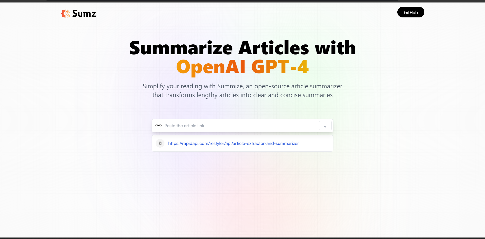
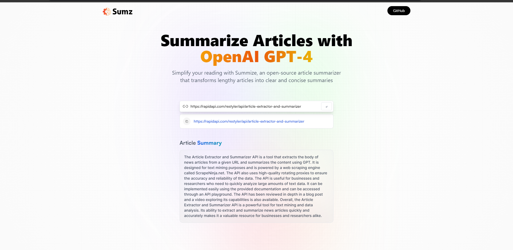

# OpenAI Article Summarizer
###  AI based redux-React app built in vite which simplify your reading. 
It is an open-source article summarizer that transforms lengthy articles into clear and concise summaries
<br>
<p  align="center">

</p>

## Features
* It takes url of an article as an input and display the summary of the artice in just 5-10 sec. Also, it shows the previous url of the articles which were summarised using this app.
 <p  align="center">

</p><br>


## Prerequisites
Required to install and run the software:
-   [npm](https://www.npmjs.com/get-npm)
## Installing and Running
From the project folder, run these commands in console (terminal) to install dependencies and run the app:
```
npm install
npm run dev

```
Vite server is needed to run the app on local host

<br>

## Technologies Used

 - Tailwind CSS
 - ReduxJS
 - ReactJS
 - Rapid API
 - Vite
 - HTML, CSS, JS
 - NPM


